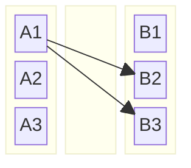
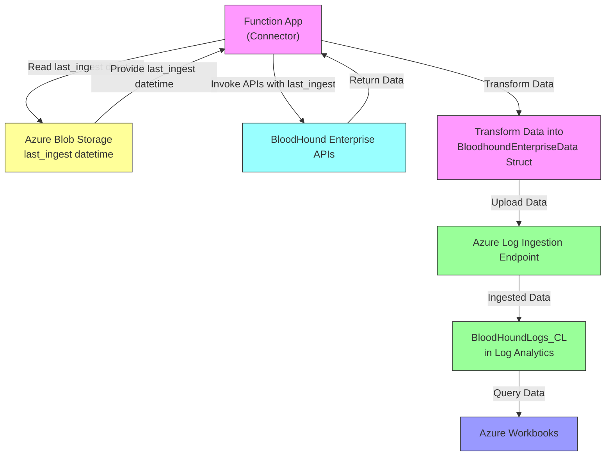
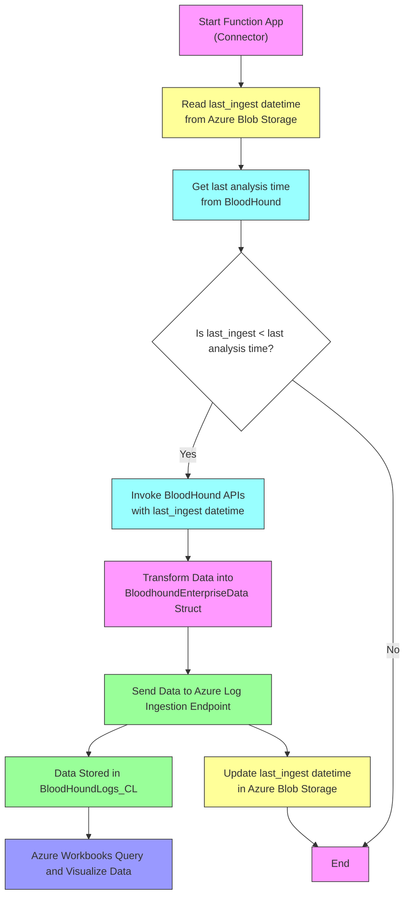
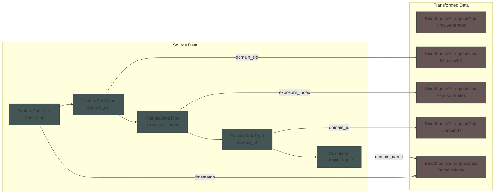
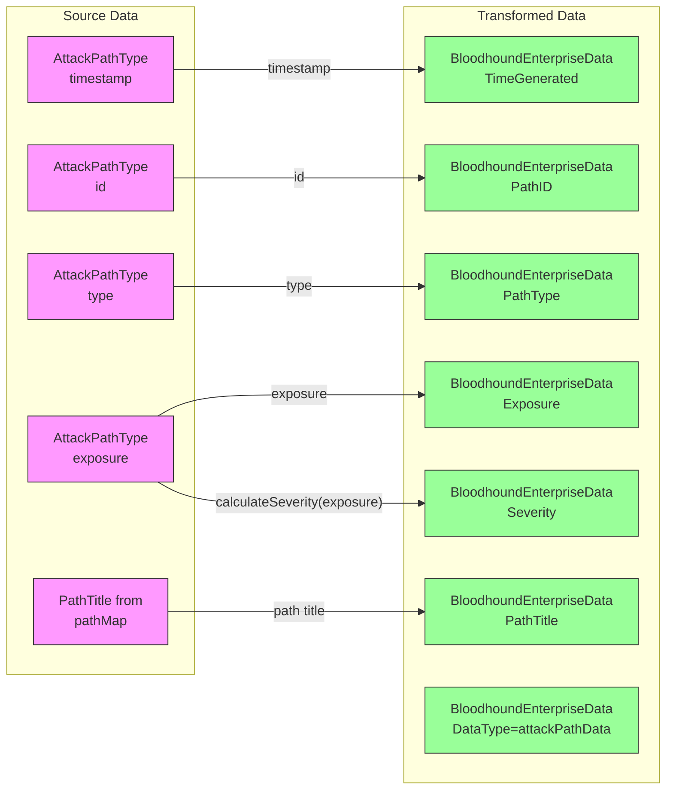

```mermaid
flowchart LR
    %% Set the main graph direction (Left to Right)
    
    subgraph Table_A [Table A]
        columns 1
        direction TB  %% Set subgraph direction to Top to Bottom
        A1[Row A1]
        A2[Row A2]
        A3[Row A3]
        
        %% Enforce the order with invisible links
        A1 --> A2
        A2 --> A3
        %% Hide these links
        linkStyle 0 stroke-width:0px
        linkStyle 1 stroke-width:0px
    end
    
    subgraph Table_B [Table B]
        direction TB
        B1[Row B1]
        B2[Row B2]
        B3[Row B3]
        
        %% Enforce the order with invisible links
        B1 --> B2
        B2 --> B3
        %% Hide these links
        linkStyle 2 stroke-width:0px
        linkStyle 3 stroke-width:0px
    end

    %% Define mappings between tables
    A1 -. Mapping 1 .-> B2
    A2 -. Mapping 2 .-> B1
    A3 -. Mapping 3 .-> B3


```








